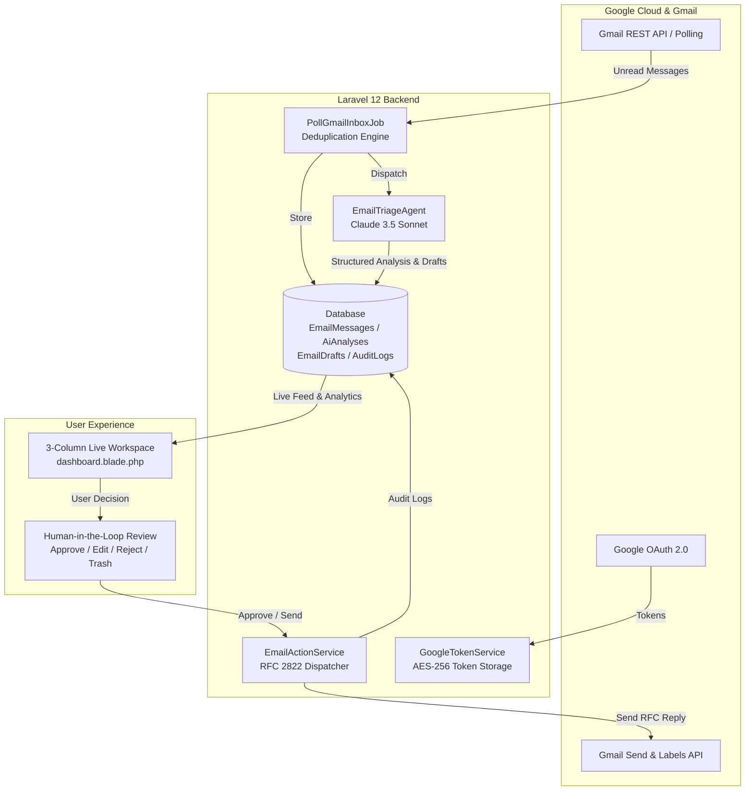

# AI Email Agent — Intelligent Gmail Workspace

> **A semi-autonomous AI email executive assistant powered by Laravel 12, Anthropic Claude 3.5 Sonnet (`laravel/ai`), and Tailwind CSS v4.**

---

## 🌟 Overview

**AI Email Agent** transforms your inbox into an intelligent, proactive workspace. Instead of spending hours reading, categorizing, and answering repetitive emails, the AI Agent:

1. **Monitors & Ingests** unread Gmail messages periodically via background scheduling or on-demand sync.
2. **Triages & Analyzes** incoming emails using **Anthropic Claude 3.5 Sonnet**, extracting structured intelligence (intent, urgency score from 1.0 to 5.0, emotional sentiment, deadlines, and suggested Gmail labels).
3. **Drafts Contextual Replies** tailored to the sender's tone and requirements.
4. **Enforces Human-in-the-Loop Control** — no email is ever sent without your explicit review and one-click approval.
5. **Executes Actions** directly on Gmail via REST API (dispatching RFC 2822 replies with thread continuity, applying labels, trashing messages).
6. **Maintains Append-Only Audit Trails** for every AI operation and human decision.

---

## 🏗️ Architecture & Subsystems



---

## 🚀 Key Features

- **Google OAuth 2.0 & Token Auto-Refresh:** Secure authentication with AES-256 encrypted access and refresh tokens. Automatically detects token expiration and refreshes against Google OAuth2 endpoints.
- **Claude 3.5 Sonnet Structured Triage:** Utilizes Laravel's official AI SDK (`laravel/ai`) to extract strongly typed JSON schema:
  - `intent`: E.g. Action Required, Meeting Request, Client Inquiry, Billing.
  - `urgency_level` & `urgency_score`: Categorized priority with 1.0–5.0 score and reasoning.
  - `sentiment`: Detected emotional tone.
  - `deadline_detected`: Extracted ISO 8601 deadlines or meeting times.
  - `suggested_labels`: Contextual Gmail-ready label recommendations.
  - `proposed_reply`: Polished, warm, professional draft.
- **Semi-Autonomous Human-in-the-Loop:**
  - **Approve & Send:** One-click dispatch with proper `In-Reply-To` and `References` headers.
  - **Edit Draft:** Save inline human revisions with full version retention.
  - **Reject Draft:** Dismiss suggested drafts with one click.
  - **Sync Labels to Gmail:** Automatically create and apply AI labels to Gmail threads.
  - **Move to Trash:** Move messages to Gmail trash and remove local records.
- **Interactive 3-Column Workspace UI:** High-density, modern editorial interface inspired by Linear and Stripe, with search, urgency filters, real-time KPI ribbons, and custom email compose modal.
- **Append-Only Audit Logging:** Records every event (`email.received`, `email.analyzed`, `draft.proposed`, `draft.edited`, `draft.rejected`, `email.sent`, `labels.applied`, `email.trashed`).

---

## 🛠️ Tech Stack

- **Framework:** [Laravel 12](https://laravel.com) (PHP 8.2+)
- **AI Engine:** [Anthropic Claude 3.5 Sonnet](https://claude.ai) via [Laravel AI SDK](https://github.com/laravel/ai) (`laravel/ai`)
- **OAuth & Gmail Integration:** `laravel/socialite` + Google REST API (v1)
- **Frontend Styling:** [Tailwind CSS v4](https://tailwindcss.com) + [Vite](https://vite.dev)
- **Database:** SQLite / MySQL / PostgreSQL with Eloquent ORM
- **Testing:** PHPUnit (100% automated test coverage, 44 tests, 211 assertions)
- **Code Standards:** Laravel Pint

---

## ⚙️ Installation & Setup

### 1. Prerequisites
- PHP 8.2 or higher
- Composer
- Node.js (v18+) and npm
- Google Cloud Console Project (with Gmail API enabled)
- Anthropic API Key

### 2. Clone & Install Dependencies
```bash
git clone https://github.com/your-username/laravel-ai-email-agent.git
cd laravel-ai-email-agent

composer install
npm install
```

### 3. Environment Configuration
Copy the `.env.example` file and generate the application key:
```bash
cp .env.example .env
php artisan key:generate
```

Update your `.env` with Google OAuth credentials and Anthropic API key:
```env
# Google OAuth 2.0 Credentials (from Google Cloud Console)
GOOGLE_CLIENT_ID=your-google-client-id
GOOGLE_CLIENT_SECRET=your-google-client-secret
GOOGLE_REDIRECT_URI="${APP_URL}/auth/google/callback"

# Anthropic Claude API Key
ANTHROPIC_API_KEY=your-anthropic-api-key
AI_DEFAULT_PROVIDER=anthropic
```

### 4. Database Migration & Asset Compilation
```bash
php artisan migrate
npm run build
```

---

## 🚦 Running the Application

### 1. Start the Local Server
```bash
php artisan serve
```

### 2. Start the Queue Worker (for AI Analysis & Ingestion Jobs)
```bash
php artisan queue:listen
```

### 3. Run the Scheduler (for periodic 2-minute Gmail inbox polling)
```bash
php artisan schedule:work
```

### 4. Manual Inbox Sync (CLI)
You can manually trigger inbox sync at any time via Artisan:
```bash
# Sync all connected accounts
php artisan email:sync

# Sync a specific user by ID
php artisan email:sync --user=1
```

---

## 🧪 Testing & Verification

Run the full automated test suite:
```bash
php artisan test
```

**Test Suite Coverage (44 passing tests, 211 assertions):**
- `Tests\Unit\OAuthTokenTest`: Token encryption, expiration grace window, scope validation.
- `Tests\Unit\GoogleTokenServiceTest`: Auto-token refresh and token revocation.
- `Tests\Feature\GoogleAuthTest`: OAuth redirect, callback, disconnection, and route protection.
- `Tests\Feature\PhaseTwoModelsTest`: Eloquent relationships, JSON/datetime casts, status scopes.
- `Tests\Feature\PhaseThreeTriageTest`: Claude 3.5 Sonnet triage, structured outputs, draft generation.
- `Tests\Feature\PhaseFourGmailSyncTest`: Gmail API parsing, label creation, RFC email sending.
- `Tests\Feature\PhaseFiveEmailActionTest`: Human approvals, draft revisions, rejections, security authorization.
- `Tests\Feature\DashboardWorkspaceTest`: KPI statistics, search, urgency filters, manual sync.
- `Tests\Feature\EndToEndEmailWorkflowTest`: Full integration lifecycle from OAuth to Gmail dispatch.

Run the code formatter:
```bash
vendor/bin/pint --format agent
```

---

## 📂 Project Structure

```
├── app/
│   ├── Ai/
│   │   └── Agents/
│   │       └── EmailTriageAgent.php       # Claude 3.5 Sonnet Structured Output Agent
│   ├── Console/
│   │   └── Commands/
│   │       └── SyncGmailInboxCommand.php  # php artisan email:sync
│   ├── Http/
│   │   ├── Controllers/
│   │   │   ├── DashboardController.php    # Live Workspace Dashboard & Sync
│   │   │   ├── EmailActionController.php  # Human-in-the-Loop Actions (Approve/Edit/Reject)
│   │   │   └── GoogleAuthController.php   # Google OAuth 2.0 Flow
│   │   └── Requests/
│   │       ├── EditDraftRequest.php
│   │       └── SendCustomEmailRequest.php
│   ├── Jobs/
│   │   ├── AnalyzeEmailJob.php            # Queued Claude AI Processing Job
│   │   └── PollGmailInboxJob.php          # Queued Gmail Inbox Polling Job
│   ├── Models/
│   │   ├── AiAnalysis.php                 # Claude Reasoning & Triage Data
│   │   ├── AuditLog.php                   # Append-Only Event Logger
│   │   ├── EmailDraft.php                 # Proposed & Edited Reply Drafts
│   │   ├── EmailMessage.php               # Ingested Gmail Message Records
│   │   ├── OAuthToken.php                 # AES-256 Encrypted Google OAuth Tokens
│   │   └── User.php
│   └── Services/
│       ├── EmailActionService.php         # Action Execution & Approval Engine
│       ├── EmailAnalyzerService.php       # Prompt Builder & Analysis Orchestrator
│       ├── GmailApiService.php            # Gmail REST API & MIME Parser Service
│       └── GoogleTokenService.php         # Token Refresh & Expiration Service
├── config/
│   ├── ai.php                             # Laravel AI SDK Provider Configuration
│   └── services.php                       # Google OAuth Credentials & Scopes
├── database/
│   ├── factories/                         # Full Model Factories
│   └── migrations/                        # Database Schema Migrations
├── resources/
│   └── views/
│       ├── dashboard.blade.php            # 3-Column AI Email Workspace
│       └── marketing/index.blade.php      # Interactive Marketing Landing Page
└── tests/
    ├── Feature/                           # Comprehensive Feature & Integration Tests
    └── Unit/                              # Unit Tests for Services & Models
```

---

## 📄 License
Open-sourced software licensed under the [MIT license](LICENSE).
