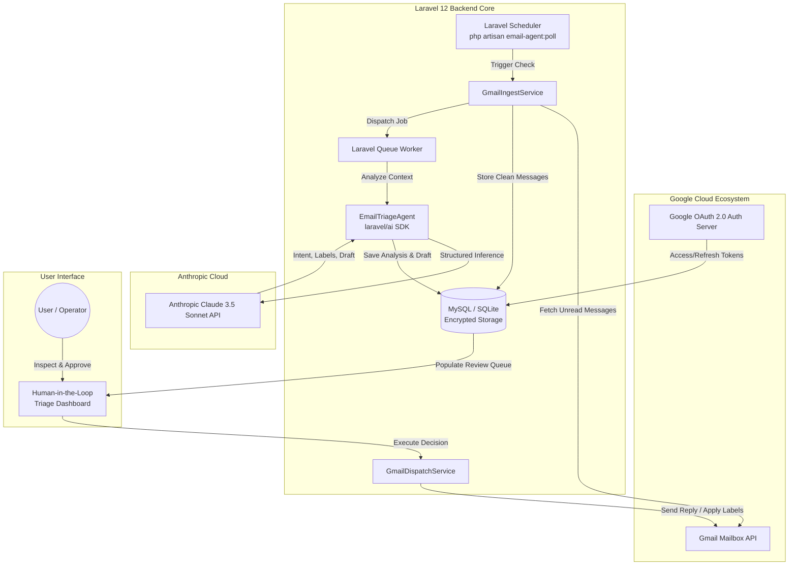
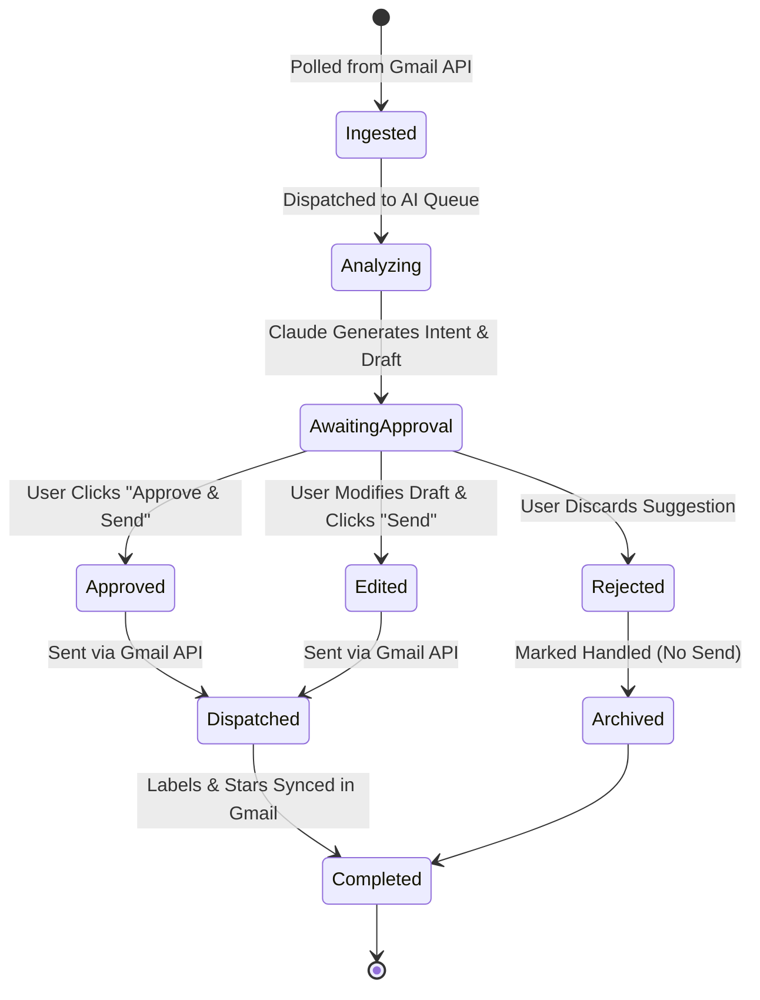

# Technical Architecture & System Design Document

**System:** Email AI Agent  
**Framework:** Laravel 12  
**AI Intelligence:** Anthropic Claude 3.5 Sonnet (`laravel/ai`)  
**External Integration:** Google Gmail REST API v1  

---

## 1. High-Level System Architecture



---

## 2. Message Lifecycle & State Machine



---

## 3. Database Schema Design

### 3.1 `users`
Standard Laravel user authentication table.

### 3.2 `oauth_tokens`
Stores encrypted Google OAuth credentials.
```sql
CREATE TABLE oauth_tokens (
    id BIGINT UNSIGNED AUTO_INCREMENT PRIMARY KEY,
    user_id BIGINT UNSIGNED NOT NULL,
    provider VARCHAR(50) DEFAULT 'google',
    access_token TEXT NOT NULL,       -- Encrypted with AES-256
    refresh_token TEXT NOT NULL,      -- Encrypted with AES-256
    expires_at TIMESTAMP NULL,
    scopes JSON NULL,
    created_at TIMESTAMP NULL,
    updated_at TIMESTAMP NULL,
    FOREIGN KEY (user_id) REFERENCES users(id) ON DELETE CASCADE
);
```

### 3.3 `email_messages`
Stores ingested raw and sanitized email metadata.
```sql
CREATE TABLE email_messages (
    id BIGINT UNSIGNED AUTO_INCREMENT PRIMARY KEY,
    user_id BIGINT UNSIGNED NOT NULL,
    gmail_message_id VARCHAR(100) UNIQUE NOT NULL,
    gmail_thread_id VARCHAR(100) NOT NULL,
    sender_name VARCHAR(255) NULL,
    sender_email VARCHAR(255) NOT NULL,
    recipient_email VARCHAR(255) NOT NULL,
    subject VARCHAR(500) NULL,
    snippet TEXT NULL,
    body_plain LONGTEXT NULL,
    body_html LONGTEXT NULL,
    has_attachments BOOLEAN DEFAULT FALSE,
    received_at TIMESTAMP NOT NULL,
    is_read BOOLEAN DEFAULT FALSE,
    created_at TIMESTAMP NULL,
    updated_at TIMESTAMP NULL,
    INDEX (gmail_thread_id),
    INDEX (sender_email)
);
```

### 3.4 `ai_analyses`
Stores Claude 3.5 Sonnet's structured reasoning and telemetry.
```sql
CREATE TABLE ai_analyses (
    id BIGINT UNSIGNED AUTO_INCREMENT PRIMARY KEY,
    email_message_id BIGINT UNSIGNED NOT NULL,
    model_version VARCHAR(100) DEFAULT 'claude-3-5-sonnet',
    intent VARCHAR(255) NOT NULL,
    urgency_level ENUM('urgent', 'important', 'routine') NOT NULL,
    urgency_score DECIMAL(3,1) NOT NULL, -- e.g. 9.8
    sentiment VARCHAR(100) NULL,
    deadline_detected TIMESTAMP NULL,
    suggested_labels JSON NOT NULL,      -- e.g. ["Client", "Urgent", "Contract"]
    summary TEXT NOT NULL,
    requires_reply BOOLEAN DEFAULT TRUE,
    tokens_used INT UNSIGNED NULL,
    raw_response JSON NULL,
    created_at TIMESTAMP NULL,
    updated_at TIMESTAMP NULL,
    FOREIGN KEY (email_message_id) REFERENCES email_messages(id) ON DELETE CASCADE
);
```

### 3.5 `email_drafts`
Stores AI-generated response drafts and human edit diffs.
```sql
CREATE TABLE email_drafts (
    id BIGINT UNSIGNED AUTO_INCREMENT PRIMARY KEY,
    email_message_id BIGINT UNSIGNED NOT NULL,
    ai_analysis_id BIGINT UNSIGNED NOT NULL,
    proposed_body LONGTEXT NOT NULL,
    edited_body LONGTEXT NULL,
    status ENUM('pending', 'approved', 'edited', 'rejected', 'sent') DEFAULT 'pending',
    sent_at TIMESTAMP NULL,
    gmail_sent_message_id VARCHAR(100) NULL,
    created_at TIMESTAMP NULL,
    updated_at TIMESTAMP NULL,
    FOREIGN KEY (email_message_id) REFERENCES email_messages(id) ON DELETE CASCADE,
    FOREIGN KEY (ai_analysis_id) REFERENCES ai_analyses(id) ON DELETE CASCADE
);
```

### 3.6 `audit_logs`
Full non-repudiation audit trail for all AI actions and operator decisions.
```sql
CREATE TABLE audit_logs (
    id BIGINT UNSIGNED AUTO_INCREMENT PRIMARY KEY,
    user_id BIGINT UNSIGNED NOT NULL,
    email_message_id BIGINT UNSIGNED NULL,
    event_type VARCHAR(100) NOT NULL, -- e.g. 'draft.approved', 'draft.edited', 'message.sent'
    metadata JSON NULL,
    created_at TIMESTAMP NULL
);
```

---

## 4. AI Structured Schema (`laravel/ai`)

Anthropic Claude 3.5 Sonnet is instructed to output a rigid JSON schema:

```json
{
  "$schema": "http://json-schema.org/draft-07/schema#",
  "type": "object",
  "properties": {
    "intent": {
      "type": "string",
      "description": "Executive one-sentence intent summary"
    },
    "urgency_level": {
      "type": "string",
      "enum": ["urgent", "important", "routine"]
    },
    "urgency_score": {
      "type": "number",
      "minimum": 1.0,
      "maximum": 10.0
    },
    "sentiment": {
      "type": "string",
      "description": "Tone assessment: frustrated, inquiring, neutral, delighted, urgent"
    },
    "deadline_detected": {
      "type": ["string", "null"],
      "description": "ISO 8601 date-time string if deadline mentioned, else null"
    },
    "suggested_labels": {
      "type": "array",
      "items": { "type": "string" }
    },
    "summary": {
      "type": "string",
      "description": "2-sentence thread briefing"
    },
    "requires_reply": {
      "type": "boolean"
    },
    "suggested_reply": {
      "type": "string",
      "description": "Professional response draft ready to send"
    }
  },
  "required": ["intent", "urgency_level", "urgency_score", "suggested_labels", "summary", "requires_reply", "suggested_reply"]
}
```

---

## 5. Security & Data Protection Scheme

1. **Credential Encryption:** All OAuth access and refresh tokens stored in `oauth_tokens` are encrypted via AES-256 (`Crypt::encryptString`).
2. **Minimal Granular Scopes:**
   - `https://www.googleapis.com/auth/gmail.modify` (Label application & message modifications)
   - `https://www.googleapis.com/auth/gmail.compose` (Draft creation & outbound sending)
3. **Anthropic Commercial Policy Guarantee:** API calls transmitted through official SDK endpoints are covered under enterprise terms (customer data is never used to train frontier models).
4. **Zero Ghost Actions:** The outbound email dispatch mechanism requires an authenticated database record with `status = 'approved'` or `status = 'edited'` signed off by an authorized operator session.
